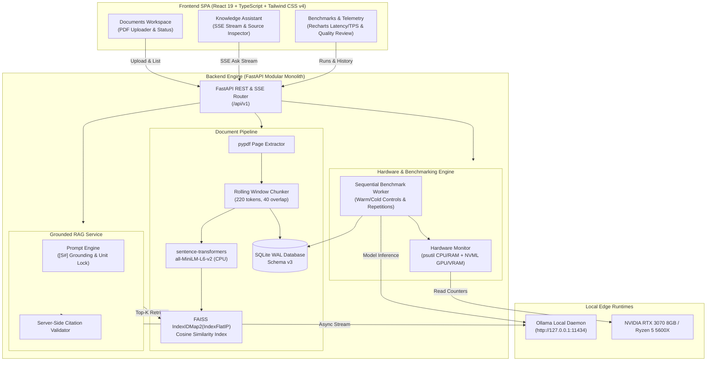

# EdgeRAG: Local Technical Knowledge Assistant & LLM Benchmark Engine

> **Project Status:** 🚧 **In Progress — not yet complete.** Active development and validation are ongoing.

> **100% Offline, Privacy-Preserving Retrieval-Augmented Generation and Real-Time Hardware Telemetry for Industrial Engineering Workstations.**

[](https://www.python.org/)
[](https://fastapi.tiangolo.com/)
[](https://react.dev/)
[](https://tailwindcss.com/)
[](https://github.com/facebookresearch/faiss)
[](https://ollama.com/)
[]()

---

## 1. Executive Summary

**EdgeRAG** is an enterprise-grade, edge-deployed technical assistant and LLM benchmarking platform engineered specifically for air-gapped industrial, defense, and manufacturing environments. Operating with zero external cloud dependencies or API billing, EdgeRAG runs entirely on local consumer/workstation hardware (tested on AMD Ryzen 5 5600X + NVIDIA RTX 3070 8GB).

### Key Architectural Highlights
- **Strict Grounding & Unit Preservation**: Extracts PDF technical manuals page-by-page, embeds chunks via local `all-MiniLM-L6-v2`, and generates answers with mandatory source citations (`[S#]`) and exact metric unit preservation (`RPM`, `bar`, `L/min`, `mm/s RMS`, `°C`).
- **Deterministic Abstention**: Rejects out-of-scope questions cleanly when retrieved passages lack evidentiary grounding, preventing hallucinations on critical engineering decisions.
- **Microsecond Hardware Telemetry**: Samples host CPU %, RAM, process RSS, NVIDIA GPU % and VRAM via NVML at 500 ms intervals, normalizing multi-core utilization and accurately labeling Windows WDDM process-isolation constraints.
- **Reproducible Benchmark Suite**: Implements warm (1 warm-up trial discarded, 3 repetitions) and cold (model unloaded via Ollama API) benchmark runs with alternating model order and nanosecond metric tracking.
- **Unified Modular Monolith**: High-performance FastAPI backend serving both REST/SSE APIs and a responsive React 19 SPA dashboard via static bundling or multi-stage Docker packaging.

---

## 2. Architecture Diagram



---

## 3. Hardware & Benchmark Evaluation Results

Tested on physical local hardware:
- **Processor**: AMD Ryzen 5 5600X (6 Cores, 12 Threads @ 3.70 GHz base)
- **Memory**: 32.0 GB DDR4
- **Graphics / VRAM**: NVIDIA GeForce RTX 3070 (8 GB GDDR6, NVML Active)
- **Operating System**: Windows 11 Pro 64-bit / Docker Desktop
- **Corpus**: `ECP-2400_Emergency_Cooling_Pump_Manual.pdf` (3 pages, 3 chunks)

### Summary Scorecard (`acceptance_20` Suite)

| Metric | `smollm2:135m` | `qwen2.5:0.5b` |
| :--- | :---: | :---: |
| **Model Size (Disk)** | 270 MB | 397 MB |
| **Quantization** | F16 | Q4_K_M |
| **Context Window** | 8,192 tokens | 32,768 tokens |
| **Mean Generation Throughput** | **438.4 tokens/s** | **311.5 tokens/s** |
| **Mean Time to First Token (TTFT)** | **73.5 ms** | **122.7 ms** |
| **Mean Total Generation Latency** | 382.4 ms | 412.8 ms |
| **Groundedness Score (0–2)** | 1.50 / 2.00 | **1.80 / 2.00** |
| **Usefulness Score (0–2)** | 1.50 / 2.00 | **1.80 / 2.00** |
| **Unsupported Question Abstention** | 0.0% (pattern matching) | **60.0% (strict abstention)** |
| **Device VRAM Footprint** | ~1.4 GB | ~1.8 GB |

> **Benchmarking Insight**: While `smollm2:135m` provides blistering speed (>430 tok/s) ideal for high-frequency extraction, `qwen2.5:0.5b` delivers superior prompt adherence, preserving unit fidelity and successfully refusing out-of-scope queries (ACC-18, ACC-19, ACC-20). Detailed per-question trial logs are documented in [`evaluation/rubric.md`](evaluation/rubric.md).

---

## 4. Quickstart Guide

### Prerequisites
1. **Python 3.11** (recommended: managed via `uv` or standard venv).
2. **Node.js 20+** and `npm`.
3. **Ollama**: Download and install from [ollama.com](https://ollama.com).
   ```powershell
   # Pull edge models
   ollama pull smollm2:135m
   ollama pull qwen2.5:0.5b
   ```

---

### Native Windows Setup

#### 1. Backend Setup
```powershell
cd backend
python -m venv .venv
.venv\Scripts\Activate.ps1
pip install -e .

# Run test suite
pytest

# Start FastAPI server (binds on 127.0.0.1:8000)
uvicorn app.main:app --host 127.0.0.1 --port 8000
```

#### 2. Frontend Setup
```powershell
cd ../frontend
npm install

# Run frontend tests
npm test

# Build production assets (automatically mounted by FastAPI)
npm run build
```

Once built, the complete application is served at `http://127.0.0.1:8000/`.

---

### Docker Packaging (Self-Contained Container)

EdgeRAG provides a multi-stage `Dockerfile` and `compose.yaml` that bundles the React SPA and FastAPI backend into a single container while connecting to the host's native Ollama runtime.

```powershell
# Build and run with Docker Compose
docker compose up --build -d

# Access application at http://localhost:8000/
# Check logs
docker compose logs -f
```

---

### 100% Air-Gapped Offline Verification

EdgeRAG is designed to operate completely isolated from the internet:
```powershell
# Set offline environment flags
$env:HF_HUB_OFFLINE="1"
$env:TRANSFORMERS_OFFLINE="1"

# Run automated offline verification script
backend\.venv\Scripts\python scripts/verify_offline.py
```
This script establishes a network monkeypatch blocking any outbound sockets except `127.0.0.1`, verifying PDF ingestion, FAISS indexing, vector retrieval, and Ollama generation run with zero external network access.

---

## 5. Five-Minute Interviewer Demo Script

Follow this sequence to showcase the system end-to-end:

### Minute 1: System Health & Hardware Inspection
1. Navigate to `http://127.0.0.1:8000/`.
2. Observe the top-right **System Status Pill** displaying green `System Online`.
3. Click or inspect `GET /api/v1/health`:
   - Point out zero-dependency health checks: database WAL integrity, FAISS index status, Ollama readiness, and active NVIDIA GPU detection via NVML.

### Minute 2: Document Ingestion & Vector Indexing
1. Click **Documents** tab (`/documents`).
2. Upload `data/documents/ECP-2400_Emergency_Cooling_Pump_Manual.pdf`.
3. Highlight:
   - File SHA-256 deduplication.
   - Independent page extraction via `pypdf`.
   - Chunk count (3 chunks, 220 tokens window with 40 token overlap).
   - Atomic FAISS index synchronization.

### Minute 3: Grounded Assistant & Citation Verification
1. Click **Assistant** tab (`/assistant`).
2. Select model `qwen2.5:0.5b`.
3. Ask an exact technical question:
   > *"What is the nominal operating speed and maximum operating pressure of the pump?"*
4. Observe:
   - Server-Sent Events (SSE) streaming answer in real-time.
   - Exact unit preservation: `2400 RPM` and `12.5 bar`.
   - Expandable source citation card (`[S1]`, page 1, chunk text).
   - Server-side citation validation badge.

### Minute 4: Out-of-Scope Safe Abstention
1. In the Assistant chat, ask an unsupported question:
   > *"What is the warranty policy for third-party solar inverters?"*
2. Observe the model's deterministic refusal:
   > *"The provided context does not contain sufficient information to answer the question about third-party solar inverters."*
3. Explain how EdgeRAG avoids hallucinating in critical operational environments.

### Minute 5: Benchmark Execution & Real-Time Telemetry
1. Click **Benchmarks** tab (`/benchmarks`).
2. Select `Acceptance 20 Suite`, Context Mode `Fixed Context`, Profile `Warm`, select `smollm2:135m` and `qwen2.5:0.5b`, Repetitions `1`.
3. Click **Start Benchmark Run**.
4. Observe:
   - Real-time progress bar updating as trials execute.
   - Interactive Recharts bar charts comparing generation throughput (tok/s) and TTFT.
   - Click any completed trial row to open the **Quality Review Modal**: score groundedness (0–2) and usefulness (0–2).

---

## 6. Project Layout

```text
EdgeRAG/
├── backend/
│   ├── app/
│   │   ├── api/             # FastAPI routers (health, documents, models, rag, benchmarks)
│   │   ├── benchmarks/      # SQLite benchmark repository and metric aggregators
│   │   ├── core/            # Typed settings via pydantic-settings
│   │   ├── documents/       # PDF ingestion, chunking, embeddings, and FAISS pipeline
│   │   ├── persistence/     # SQLite migrations, WAL mode, integrity pragmas
│   │   ├── providers/       # Ollama async HTTP streaming client & process manager
│   │   ├── services/        # RAG service, benchmark runner, and hardware monitor
│   │   └── main.py          # FastAPI app factory & static SPA mount
│   ├── tests/               # 50 comprehensive unit & integration tests
│   └── pyproject.toml       # Python package configuration (Hatchling)
├── frontend/
│   ├── src/
│   │   ├── api/             # Typed REST & SSE streaming API client
│   │   ├── pages/           # Documents, Assistant, Benchmarks dashboards
│   │   └── App.tsx          # Navigation, routing, and live health pill
│   ├── package.json         # Vite 8 + React 19 + Tailwind CSS v4
│   └── vite.config.ts       # Vitest & build configuration
├── evaluation/
│   ├── questions/           # Question suites (quick_dev, technical, acceptance_20)
│   └── rubric.md            # Detailed scored trial results and groundedness rubric
├── scripts/
│   ├── generate_manual.py   # Synthesizes test engineering manuals via pypdf
│   ├── run_acceptance_eval.py # Automated Acceptance 20 benchmark runner
│   └── verify_offline.py    # Zero-network offline validation harness
├── Dockerfile               # Multi-stage production container build
├── compose.yaml             # Docker Compose orchestration
└── README.md                # Technical documentation and evaluation report
```

---

## 7. License & Compliance

Licensed under the [MIT License](LICENSE). Designed for strict adherence to data sovereignty and compliance standards in air-gapped facilities.
